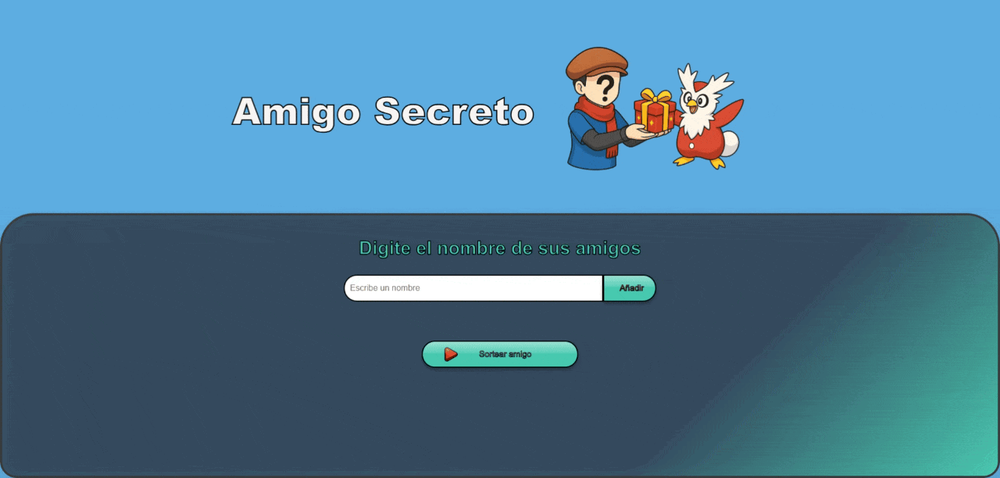

# Amigo Secreto

## Descripción

Aplicación web para organizar sorteos de "amigo secreto" de forma rápida, divertida y personalizada. Permite ingresar participantes, valida entradas y realiza el sorteo automáticamente con resultados únicos. Ideal para celebraciones y reuniones.

---

## 🔗 Demos web

- [Versión estándar (español)](https://andcarrillo.github.io/desafio-amigo-secreto/amigo-secreto_esp/)
- [Versión personalizada Pokémon](https://andcarrillo.github.io/desafio-amigo-secreto/amigo-secreto_personalizado/)

---

## 🚀 Características principales

- Validación automática y sorteo único.
- Interfaz personalizable y visualmente atractiva.
- Animaciones de confeti y sonidos de interacción en la versión personalizada.
- Fácil de usar en cualquier evento.

## 🗂️ Estructura del proyecto

- `amigo-secreto_esp/`: Versión estándar en español.
- `amigo-secreto_personalizado/`: Versión avanzada con estilos Pokémon, fuente especial, efectos visuales, sonidos y animación de confeti.
  - `index.html`: Página principal.
  - `app.js`: Lógica de la aplicación.
  - `style.css`: Estilos visuales.
  - `assets/`: Imágenes, sonidos y recursos gráficos.

---

## 🖼️ Vista personalizada

---

## 🛠️ Cómo usar

1. Clona el repositorio o descarga los archivos.
2. Abre `index.html` en tu navegador preferido.
3. Ingresa los nombres y realiza el sorteo.

---

## 👥 Créditos

Proyecto desarrollado para el desafío "Amigo Secreto" de Oracle Next Education (ONE) y Alura Latam.

     + 

